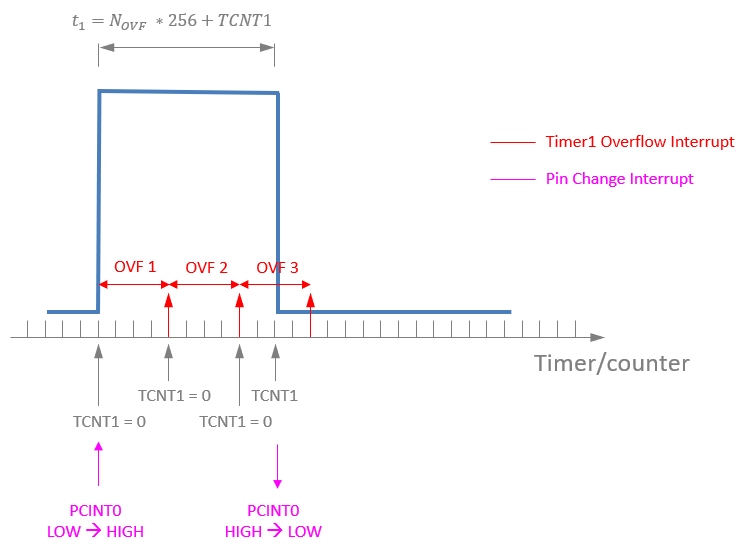

# ATTINY85 RC Receiver Signal Decoder

An RC receiver signal decoder using an [AVR ATTINY85 microcontroller](https://www.microchip.com/wwwproducts/en/ATtiny85). The decoder has a 10-bit resolution for the RC receiver pulse (1ms-2ms).

## Features
  - To resolve the PWM pulse, pin change interrupts are used to be able to do the timing between rising and falling edge of the RC receiver signal
  - Timer1 is used with a prescaler of 8 (CK/8) which results in timesteps of 1 microseconds. Thus, for the full 2ms pulse 2000 steps are available
  - Operates at 10-bit resolution (modern RC controllers operate at 12-bit stick resolution). The code should work also without prescaler (at 8MHz) which would be roughly a 13-bit resolution (not tested yet)
  - An LED attached to LED_PORT indicates the RC control stick position (use a 200&Omega; resistor for the LED)
    - The function *LED_Control(60)* would light the LED if the RC control stick of the corresponding channel is at 60% or more
  - The pins for receiver and LED can be configured by the corresponding macros (RC_RECEIVER_PORT, LED_PORT). Do not use VCC, GND and RESET pins
  - Oscillator calibration:
    - The factory calibration for one specific ATTINY85 was 148 (0x94 read from chip via ATMEL STUDIO "Device Programming")
    - This setup gave a measured frequency of 8.196MHz which is slightly more than 2% off the target speed
    - Using the OSCCAL register the clock speed can be calibrated
    - The code currently uses *OSCCAL = 142;* which resulted in 7.96MHz and peaks of 8MHz

## RC Servo PWM signal

The typical RC servo signal is a 50 HZ PWM signal. The duty cycle is between 5% (1 ms) and 10% (2 ms) with respect to this 50 Hz (20 ms). These are *standard* values which can vary depending on the servo type. The servo electronics does not react directly on the duty cycle in percent, the frequency is allowed to deviate a lot. The servo reacts on the duration of the pulse only, i.e. the time where the signal is *HIGH*. This time normally varies between 1ms and 2ms, which also represents the minimum and maximum rotation angle of the servo. Thus, a duration of 1.5ms denotes the servo center position. As mentioned these are the *standard* values, so some servos can deviate from that. Most radio-controllers send exatly those 1ms to 2ms pulses.

## Decoding the RC signal with timer and pin change interrupts

The signal decoding algorithm depends on pin change interrupts and timer overflow interrupts. The signal starts whith a pin change interrupt where the signal jumps from *LOW* to *HIGH*. Then the timer ist started and due to its configuration of 1 microsecond per time step it will overflow several times. This is because the timing is done for at least 1ms which results in 1000 timer steps. As the counter is 8-bit it has an overflow each 256 steps. To get the duration of the pulse the number of overflows until the next pin change interrupt (from *HIGH* to *LOW*) is tracked.

The total pulse time is calculated by multiplying the number of timer overflows by 256 and adding the remaining counts which occur between the last timer overflow and the pin change interrupt. For details see the figure below.

## Example Breadboard Configuration

Obviously, before use, the code **main.c** needs to be programmed on the device via any ISP programmer.

## Prerequisites (fuse setting)
 - For the code to work the CPU needs to run at 8 MHz (this is NOT the factory default)
 - The fuse **CKDIV8** has to be unset, otherwise the CPU would run at 1 MHz
 - Several approaches can be used to set the fuses (see blow)

 ### Set Fuses via ATMEL Studio

<!--- HTML code used in order to be able to resize image -->

**Setting of fuses in ATMEL Studio 7 - CKDIV8 unchecked for 8 MHz clock speed**

 ### Set Fuses via ***AVRDUDE***

Alternatively, the fuses can be set via command line using ***avrdude***, which is also part of the *ARDUINO IDE* installation. If the *ARDUINO IDE* is installed, you find it in the following path:

~~~
C:\Program Files (x86)\Arduino\hardware\tools\avr\bin\avrdude.exe
~~~

To get the right settings for the fuses, tools like the [Engbedded Atmel AVR® Fuse Calculator](http://www.engbedded.com/fusecalc) are very helpful. A typical setting for the fuses would be:

~~~
LOW:       0x62
HIGH:      0xDF
EXTENDED:  0xFF
~~~

To disable the default *CKDIV8* fuse (which would result in 1MHz clock speed) the low fuse has to be set to:

~~~
LOW:       0xE2
~~~

Following ***avrdude*** command does that (for better readability the command is split onto multiple lines):

~~~
C:\Program Files (x86)\Arduino\hardware\tools\avr\bin\avrdude.exe
-p t85         # for ATTINY85
-c stk500      # for an STK500 compatible programmer (e.g. DIAMEX or ARDUINO as ISP)
-P COM5        # port where the programmer is connected (check COM port in the Windows device manager)
-C "c:\Program Files (x86)\Arduino\hardware\tools\avr\etc\avrdude.conf"  # avrdude configuration file
-U lfuse:w:0xE2:m  # set the low fuse to 0xE2
-v
~~~

### Set Fuses via the ***ARDUINO IDE***

The last alternative is to go directly via the *ARDUINO IDE*. This requires an ATTINY core like [this one](https://github.com/damellis/attiny) installed in the IDE. Then select *ATTINY85* from the boards and also 8MHz clock speed. After that burn the bootloader.

## Additional information
 - Official MICROCHIP [ATTINY85 datasheet](http://ww1.microchip.com/downloads/en/DeviceDoc/Atmel-2586-AVR-8-bit-Microcontroller-ATtiny25-ATtiny45-ATtiny85_Datasheet.pdf)

  

Distributed under the MIT license. See [LICENSE](https://github.com/chiefenne/ATTINY85-Servo-Control/blob/master/LICENSE) for more information.

