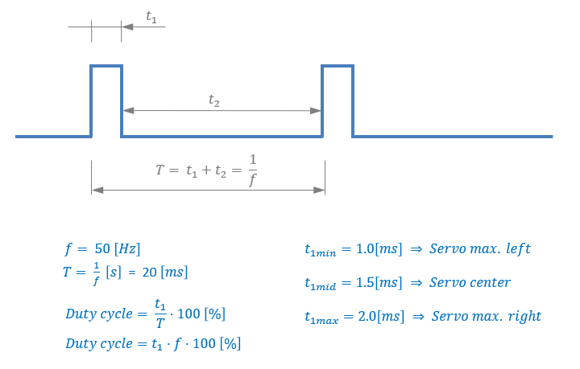
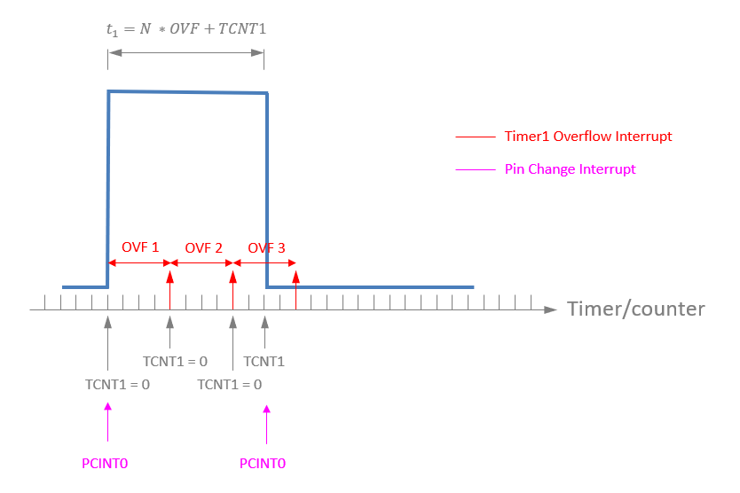
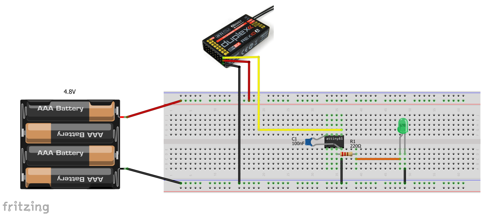
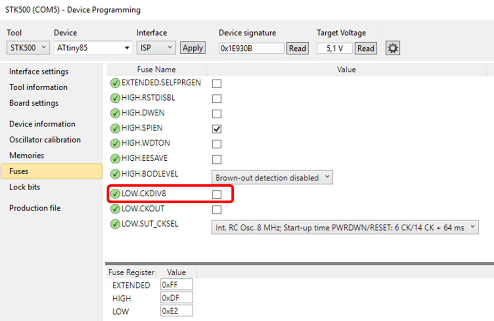

# ATTINY85 RC Receiver Signal Decoder

An RC receiver signal decoder using an [AVR ATTINY85 microcontroller](https://www.microchip.com/wwwproducts/en/ATtiny85). The decoder has a 10-bit resolution for the RC receiver pulse (1ms-2ms).

## Features
  - To resolve the PWM pulse, pin change interrupts are used to be able to do the timing between rising and falling edge of the RC receiver signal
  - Timer1 is used with a prescaler of 8 (CK/8) which results in timesteps of 1 microseconds. Thus, for the full 2ms pulse 2000 steps are available
  - Operates at 10-bit resolution (modern RC controllers operate at 12-bit stick resolution). The code should work also without prescaler (at 8MHz) which would be roughly a 13-bit resolution (not tested yet)
  - An LED attached to LED_PORT indicates the RC control stick position (use a 200&Omega; resistor for the LED)
    - The function *LED_Control(60)* would light the LED if the RC control stick of the corresponding channel is at 60% or more
  - The pins for receiver and LED can be configured by the corresponding macros (RC_RECEIVER_PORT, LED_PORT). Do not use VCC, GND and RESET pins
  - Oscillator calibration:
    - The factory calibration for one specific ATTINY85 was 148 (0x94 read from chip via ATMEL STUDIO "Device Programming")
    - This setup gave a measured frequency of 8.196MHz which is slightly more than 2% off the target speed
    - Using the OSCCAL register the clock speed can be calibrated
    - The code currently uses *OSCCAL = 142;* which resulted in 7.96MHz and peaks of 8MHz

## Servo PWM signal

## Decoding signal with timer and pin change interrupts

## Example Breadboard Configuration

Obviously, before use, the code **main.c** needs to be programmed on the device via any ISP programmer.

## Prerequisites
 - For the code to work the CPU needs to run at 8 MHz (this is NOT the factory default)
 - The fuse **CKDIV8** has to be unset, otherwise the CPU would run at 1 MHz

<!--- HTML code used in order to be able to resize image -->

**Setting of fuses in ATMEL Studio 7 - CKDIV8 unchecked for 8 MHz clock speed**

## Additional information
 - Official MICROCHIP [ATTINY85 datasheet](http://ww1.microchip.com/downloads/en/DeviceDoc/Atmel-2586-AVR-8-bit-Microcontroller-ATtiny25-ATtiny45-ATtiny85_Datasheet.pdf)

  

Distributed under the MIT license. See [LICENSE](https://github.com/chiefenne/ATTINY85-Servo-Control/blob/master/LICENSE) for more information.

